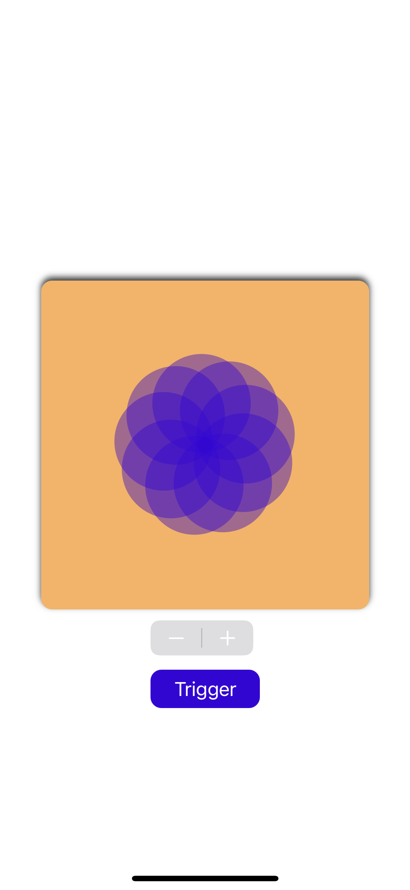

# BreatheAnimation
A take on Apple's breathe feature on the Watch

## Motivation
I saw this animation on a Twitter post and the user had created it in SwiftUI. I liked the way it looked and tried to see if I could recreate it using UIKit.

## Screenshots

  
  

## Tech/frameworks used
Entire project was done using Swift. Interface was built programmatically using UIKit. Most of the magic is done using CoreAnimation. CAShapeLayers to draw the circle shape, CAReplicatorLayer to control the number of circles and their positioning relative to each other, and CABasicAnimation + CAAnimationGroup for the actual animation.
